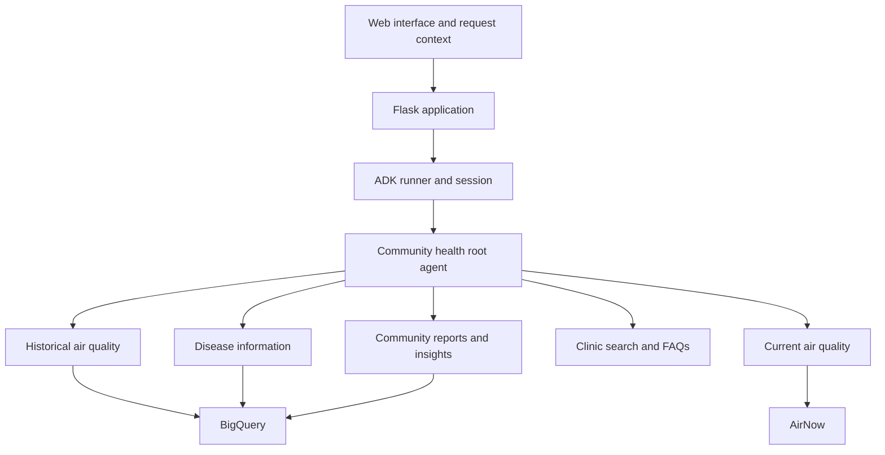

# AI-mmunity: integrating a team-built ADK agent system

By Yoha (Eyoha Girma). Source walkthrough reviewed September 22, 2026.

AI-mmunity brings several kinds of community-health information into one interface: historical air quality, current air readings, disease data, clinic search, and community reports. The engineering problem is coordinating these capabilities while preserving the meaning and limits of each source.

[Next ’26 presentation and team](https://yoha02.github.io/A4G_LandingPage/) · [Technical talk recap](https://www.linkedin.com/feed/update/urn:li:activity:7459590446554435584/)

## My role

I led the team, coordinated and integrated code from teammates, and worked on agent setup and orchestration. My contribution connected separately developed capabilities into the shared application and agent workflow. This is a collaborative project, not a claim that I authored every specialist or integration.

The team was Abhi Ram Salammagari, Eyoha Girma, Semaa Amin, Aashna Kunkolienker, Tianchen Cai, and Sreekanth Kannan. Our team won Google Cloud's Agentic AI Arena. I presented **Silos to Synergy: Architecting Scalable Multi-Agent Systems** at the Google Cloud Next ’26 Developer Theater.

## How the system fits together

This is a simplified source map, not a diagram of every optional feature or a deployment certification. Analytics and outreach/video agents are additional integrations in the source.

| Integration point | What to inspect | Why it matters |
|---|---|---|
| Specialist registration | [`create_root_agent_with_context`](../multi_tool_agent_bquery_tools/agent.py) | The root registers the specialists through ADK's `sub_agents` interface; optional analytics and PSA agents extend that list. |
| Persona and instructions | [`persona_aware_instruction_provider`](../multi_tool_agent_bquery_tools/agent.py) | Resident and official personas get different task descriptions and routing guidance. Prompt selection is distinct from backend authorization. |
| Runtime and context | [`call_agent` and runner setup](../multi_tool_agent_bquery_tools/agent.py) | Location, time frame, and persona need to reach the agent consistently across the application boundary. |
| Specialist implementations | [`agents/`](../multi_tool_agent_bquery_tools/agents/) | Current air readings and historical air quality are separate capabilities. Their outputs should not be described interchangeably. |
| Application integration | [`app_local.py`](../app_local.py) | The application connects the interface, data services, and agent entry point. |

## An example to trace

Compare two requests: “What is the air quality now?” and “What was air quality like in 2020?”

1. Inspect the root's routing instructions for current versus historical requests.
2. Follow the referenced specialist to its tool and data source.
3. Check how location and date constraints reach the tool.
4. Inspect the returned source and time period before interpreting the answer.

This exercise exposes a common integration mistake: a plausible answer can still come from the wrong source or time window. The talk's system-level evaluation theme applies to agent selection, tool arguments, provenance, and the final explanation together.

## Architecture tradeoffs

- **Specialists simplify local responsibilities but add integration boundaries.** Each specialist can focus on its tools and instructions. The whole system still needs checks for ambiguous routing, missing context, tool failure, and inconsistent outputs.
- **Dynamic persona instructions avoid duplicating the whole agent tree.** They adapt communication and routing guidance. They do not enforce permissions; authorization belongs in the application and tool/data layers.
- **An in-memory session service keeps prototype setup small.** The inspected module uses shared runner/session state. Session isolation and durable state require explicit verification before a multi-user production deployment.
- **Optional imports let the prototype start with fewer features.** A missing integration must be surfaced in the capability list and user experience, rather than allowing the model to promise an unavailable tool.

These are tradeoffs visible in the current implementation and lessons for readers; no measured performance improvement is claimed here.

## What to evaluate next

| Case | Expected check |
|---|---|
| Current versus historical air quality | Correct specialist, source, and time range. |
| Missing county or unclear date | Clarification before a misleading localized answer. |
| Data service unavailable | An explicit limitation, without invented readings. |
| Resident requests an official-only operation | The application/tool layer enforces the relevant permission. |
| Two users with different locations | Their session state remains isolated. |

This table is an evaluation plan, not a report of passing tests. The source walkthrough did not execute the cloud services. Historical EPA data, current readings, fallback data, and generated explanations need distinct labels. The deployment URL and setup instructions also need a separate end-to-end validation pass.

## Extend the learning

Read the [illustrated ADK guide](https://agenticworks.com/forum/google-adk-deep-dive), then inspect one specialist and explain its input contract, data source, failure behavior, and permission boundary. Open an issue with a concrete example if the code or documentation leaves one of those unclear.
